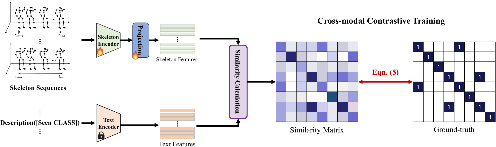
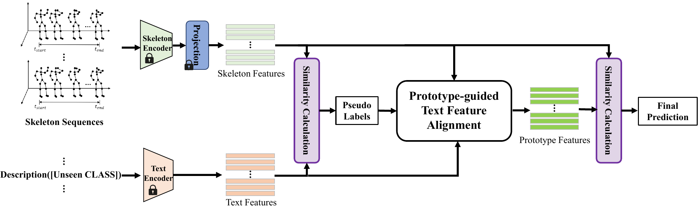
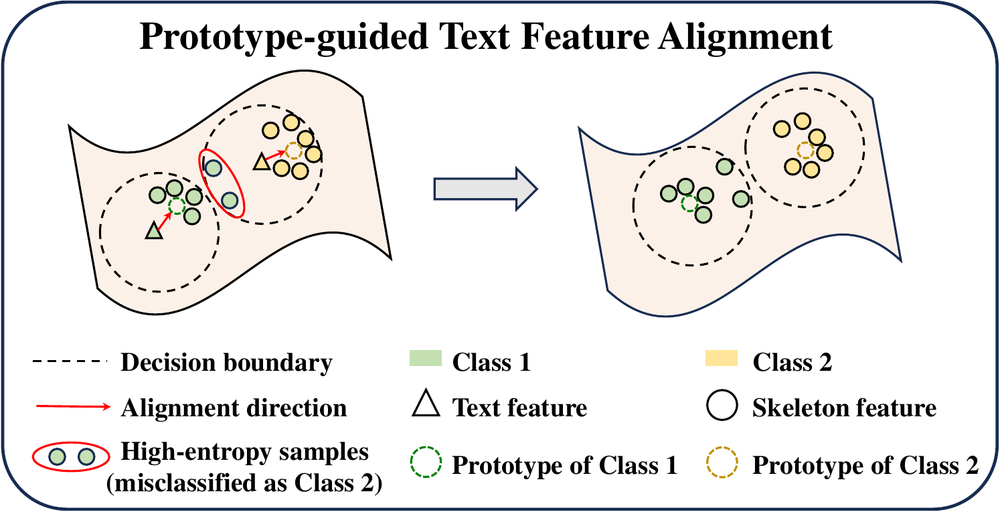

# Zero-shot Skeleton-based Action Recognition with Prototype-guided Feature Alignment [TIP 2025](https://doi.org/10.1109/TIP.2025.3586487)
> [Kai Zhou](https://kaai520.github.io), [Shuhai Zhang](https://zshsh98.github.io), [Zeng You](https://www.youzeng.com.cn), [Jinwu Hu](https://fhujinwu.github.io), [Mingkui Tan](https://tanmingkui.github.io/), and [Fei Liu](https://scholar.google.com/citations?user=gC-YMYgAAAAJ)\
South China University of Technology

<a href="https://arxiv.org/abs/2507.00566v1" target='_blank'>


[](https://paperswithcode.com/sota/zero-shot-skeletal-action-recognition-on-pku?p=zero-shot-skeleton-based-action-recognition-2)
[](https://paperswithcode.com/sota/zero-shot-skeletal-action-recognition-on-ntu?p=zero-shot-skeleton-based-action-recognition-2)
[](https://paperswithcode.com/sota/zero-shot-skeletal-action-recognition-on-ntu-1?p=zero-shot-skeleton-based-action-recognition-2)
[](https://paperswithcode.com/sota/one-shot-3d-action-recognition-on-ntu-rgbd?p=zero-shot-skeleton-based-action-recognition-2)

This is an official PyTorch implementation of **"Zero-shot Skeleton-based Action Recognition with Prototype-guided Feature Alignment" in IEEE TIP 2025**.

## Abstract
Zero-shot skeleton-based action recognition aims to classify unseen skeleton-based human actions without prior exposure to such categories during training. This task is extremely challenging due to the difficulty in generalizing from known to unknown actions. Previous studies typically use two-stage training: pre-training skeleton encoders on seen action categories using cross-entropy loss and then aligning pre-extracted skeleton and text features, enabling knowledge transfer to unseen classes through skeleton-text alignment and language models' generalization.
However, their efficacy is hindered by 1) insufficient discrimination for skeleton features, as the fixed skeleton encoder fails to capture necessary alignment information for effective skeleton-text alignment; 2) the neglect of alignment bias between skeleton and unseen text features during testing. 
To this end, we propose a prototype-guided feature alignment paradigm for zero-shot skeleton-based action recognition, termed PGFA.
Specifically, we develop an end-to-end cross-modal contrastive training framework to improve skeleton-text alignment, ensuring sufficient discrimination for skeleton features. Additionally, we introduce a prototype-guided text feature alignment strategy to mitigate the adverse impact of the distribution discrepancy during testing.
We provide a theoretical analysis to support our prototype-guided text feature alignment strategy and empirically evaluate our overall PGFA on three well-known datasets.
Compared with the top competitor SMIE method, our PGFA achieves absolute accuracy improvements of 22.96\%, 12.53\%, and 18.54\% on the NTU-60, NTU-120, and PKU-MMD datasets, respectively.

## Framework
### Training Framework

### Testing Framework

<!-- {:style="width:50%"} -->


## Requirements

```
sacred
tqdm
einops
torch==1.13.1
logging
sentence-transformers
pprint
scikit-learn
```

## Installation
```bash
# Install the python libraries
$ cd PGFA
$ pip install -r requirements.txt

# Install the ShiftGCN
$ cd ./module/Temporal_shift
$ bash run.sh
```

Please consult the official installation tutorial (e.g., [ShiftGCN](https://github.com/kchengiva/Shift-GCN) and [PyTorch](https://pytorch.org/get-started/previous-versions/)) if you experience any difficulties.

## Data Preparation
We apply the same dataset processing as [SMIE](https://github.com/YujieOuO/SMIE). You can download in BaiduYun link [data.zip](https://pan.baidu.com/s/1G8q_0fhLGIlNrCt4Oy0pkg) [Extraction code: pgfa]. Please download and extract it to the current folder (PGFA). 

The subfolder "zero-shot" of "data" contains the processed skeleton data for each dataset, already split into seen and unseen categories. The subfolder "language" contains the pre-extracted text features obtained using Sentence-Bert.

* [dataset]_embeddings.npy: based on label names using Sentence-Bert.
* [dataset]_des_embeddings.npy: based on complete descriptions using Sentence-Bert.

If you don't want to download data.zip using BaiduYun link, please contact kayjoe0723@gmail.com. If you want to process the data by yourself, please refer to the Data Preparation section in [SMIE](https://github.com/YujieOuO/SMIE).

## Action Label Descriptions
The total label descriptions can be found in ./descriptions.

## Different Experiment Settings
Our PGFA employs two experiment setting.
* Setting 1 : three datasets are used (NTU-60, NTU-120, PKU-MMD), and each dataset have three random splits. The skeleton feature extractor is classical ST-GCN.
* Setting 2: two datasets are used, split_5 and split_12 on NTU60, and split_10 and split_24 on NTU120. The skelelton feature extractor is Shift-GCN. 

### Setting 1

#### Training & Testing
Example for training and testing on NTU-60 split_1.  
```bash
# Setting 1
$ python main.py with 'train_mode="main"'
```
You can change some settings of config.py.  

### Setting 2
#### Training & Testing
Example for training and testing on NTU-60 split_5 data.
```bash
# Setting 2
$ python main.py with 'train_mode="sota"'
```
You can also choose different split id of config.py (sota compare part).  

## Todo List
- [ ] Upload checkpoints.
- [ ] Upload skeleton-focused descriptions and text features.
- [ ] One-shot experiments.


## Acknowledgement
* The codebase is from [MS2L](https://github.com/LanglandsLin/MS2L).
* The skeleton backbones are based on [ST-GCN](https://github.com/yysijie/st-gcn/blob/master/OLD_README.md) and [ShiftGCN](https://github.com/kchengiva/Shift-GCN).
* The text feature is based on [Sentence-Bert](https://github.com/UKPLab/sentence-transformers).
* The baseline methods are from [SMIE](https://github.com/YujieOuO/SMIE).

## Licence
This project is licensed under the terms of the MIT license.

## Citation

If you use this code in your research or implementations, please cite the following paper:

```bibtex
@article{zhou2025pgfa,
  title={Zero-shot Skeleton-based Action Recognition with Prototype-guided Feature Alignment},
  author={Kai Zhou and Shuhai Zhang and Zeng You and Jinwu Hu and Mingkui Tan and Fei Liu},
  journal={IEEE Transactions on Image Processing},
  year={2025},
  publisher={IEEE},
  doi={10.1109/TIP.2025.3586487}
}
```

## Contact
For any questions, feel free to contact: kayjoe0723@gmail.com
